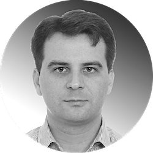

# Curriculum Vitae #

## Pavel Konyakhin ##

### Contacts ###

**Location**    |  Yerevan, Armenia  
**Phone**       |  +374 41 454741  
**Email**       |  pavel.konyakhin@gmail.com  
**GitHub**      |  [solidados](https://github.com/solidados)  
**LinkedIn**    |  [Pavel Konyakhin](https://www.linkedin.com/in/solidados/)  
**Discord**     |  Pavel Konyakhin(@solidados)

### About ###

Hardworker | Responsible | Entrained | Miscellaneous | Capable Of Learning | Outside-the-box thinking | Creative

### Skills ###

> - HTML5, CSS3  
> - JavaScript Basics  
> - SQL  

> - VS Code, Sublime Text, Brackets  
> - MySQL, Microsoft SQL Server  
> - Agility CMS, GraphCMS  
> - Git, GitHub, GitKraken, Terminal
> - Figma, Photoshop, Illustrator

## Code sample ##

```javascript
    a = parseInt(prompt ("a:"));
    b = parseInt(prompt ("b:"));
    function Max(x, y){
      if (x > y)
        return x;
      else
        return y;
    }
    z = Max (2 * b, a) * Max (2 * a - b, b);
    console.log(z);
```

## Experience ##

#### 2021 - 2022 ####  
* Backend IT specialist | *hotel's database maintenance*  
* Front End Web Developer | *freelance*  
  * [3DscrollPage](https://solidados.github.io/3dScrollPage/)
  * [DarkThemePage](https://solidados.github.io/darkThemeTmp/)

#### 2013 – 2021 ####
* Private Entrepreneur | *immigration advisor*  

#### 2010 – 2012 ####  
* Logistic engineer | *international multimodal carriages*  

#### 2008 – 2010 ####  
* Electrical engineer on projects:  
  * Volkswagen RUS | *electric works in a new biult painthouse*  
  * Airport Sheremetyevo terminal D | *baggage sorting and distribution systems*  
  * Airport Vnukovo terminal 3 | *baggage sorting and distribution systems*  

## Education ##

#### 2020 ####  
* GeekBrains University | *Front End Development*  

#### 2018 ####  
* Massachusetts Institute of Technology | *logistics & supply chain* | some courses  

#### 2008 ####  
* Moscow state academy of water transport | *logistic engineer* | Master's Degree  

#### 2004 ####  
* Maritime state university named after G.I. Nevelskoi | *logistic engineer* | Bachelor Degree  

## Languages ##

* Russian (*Native*)
* English (*Advanced*)
* Spanish (*A1 level*)
